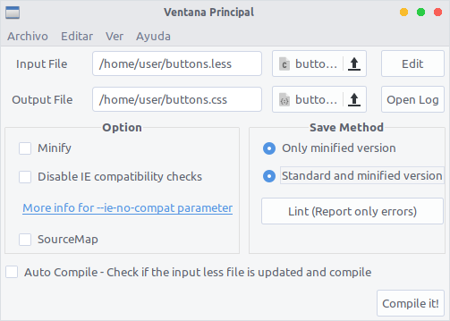

# Lua Less Compiler
Lua Less Compiler is a gui frontend for lessc.
This software require:
* [Lua5.1](https://www.lua.org/download.html)
* [Lgi](https://github.com/pavouk/lgi)
* lessc (node-less on many distro or npm install lessc)

## ScreenShot

## Contacts
- Email: diaz.victor@openmailbox.org
- Facebook: https://www.facebook.com/DiazUrbanejaVictor
- Github: https://github.com/diazvictor/

## Run

Execute: init.lua
